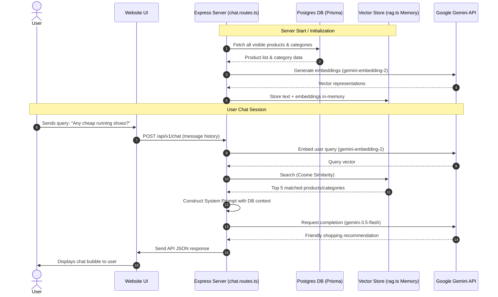

# NovaShop AI Chatbot (Nova) Integration Documentation

This document describes the technical architecture, workflow, and cost estimations for the AI-powered shopping assistant, **Nova**, integrated into the NovaShop e-commerce platform.

---

## 1. System Architecture & Workflow

The chatbot utilizes **RAG (Retrieval-Augmented Generation)** to answer user queries with up-to-date information directly from the NovaShop database (Products and Categories). This ensures that the assistant never hallucinates nonexistent products and provides accurate pricing and availability.

### High-Level Workflow Diagram

### Detailed Workflow Step-by-Step

1. **Initialization (`initializeVectorStore`)**:
   * On application startup or first chat request, the backend fetches all visible products and categories via [Prisma Client](file:///e:/Project/E-commerce project/backend/src/lib/rag.ts#L4).
   * It builds a structured text representation for each item (e.g., brand, price, stock, tags, description).
   * It calls Google's `gemini-embedding-2` model to convert these text blocks into vector embeddings, which are stored in-memory.

2. **Vector Similarity Search (`getRelevantContext`)**:
   * When a customer sends a message, the server converts the message into an embedding vector.
   * It calculates the **Cosine Similarity** between the query vector and all product embeddings in memory.
   * The top 5 closest matching results are retrieved.

3. **Prompt Injection & Execution (`chat.routes.ts`)**:
   * The server injects the matching product details into the **System Prompt** for context.
   * The message history (up to the last 10 messages) is passed to the **Gemini model (`gemini-3.5-flash`)**.
   * The model responds contextually using only the provided facts, maintaining the persona of "Nova".

---

## 2. API Pricing & Cost Estimation

Google AI Studio offers two pricing tracks: the **Free Tier** (for prototyping) and the **Paid Tier (Prepay Billing)** (for production).

### Model Pricing Table

| Model | Purpose | Input Price (per 1M tokens) | Output Price (per 1M tokens) | Key Advantage |
| :--- | :--- | :--- | :--- | :--- |
| **`gemini-embedding-2`** | Vector Search / RAG | **$0.20** | N/A | Fast, high-accuracy embeddings |
| **`gemini-3.5-flash`** | Chat Generation | **$1.50** | **$9.00** | Standard production model |
| **`gemini-3.5-flash-lite`** (Alternative) | Chat Generation | **$0.30** | **$2.50** | Ultra low cost, ideal for high traffic |

---

### Monthly Cost Estimation Scenario

To estimate the monthly operational costs, we assume a typical e-commerce storefront volume:
* **Active Users**: ~300 users chatting per day.
* **Conversations**: 1,000 user messages per day (average of ~3.3 messages per session).
* **Average Message Context (RAG)**:
  * **Input Size**: **1,500 tokens** per request (includes system instructions, chat history, and the 5 product matches retrieved by RAG).
  * **Output Size**: **150 tokens** per response.

#### 1. Daily Token Usage
* **Daily Input Tokens**: `1,000 requests * 1,500 tokens = 1,500,000 tokens` (1.5M tokens)
* **Daily Output Tokens**: `1,000 requests * 150 tokens = 150,000 tokens` (0.15M tokens)
* **Embedding Tokens (Search)**: `1,000 queries * 50 tokens = 50,000 tokens` (0.05M tokens)

#### 2. Daily Cost Calculation (using `gemini-3.5-flash`)
* **Input Cost**: `1.5M * $1.50 / 1M = $2.25`
* **Output Cost**: `0.15M * $9.00 / 1M = $1.35`
* **Embedding Cost**: `0.05M * $0.20 / 1M = $0.01`
* **Total Daily Cost**: **`$3.61`**

#### 3. Monthly Cost Calculation
* **Total Monthly Cost**: `$3.61 * 30 days = $108.30`

> [!TIP]
> **Pro-Tip for Cost Optimization:**
> If you migrate the generation model to **`gemini-3.5-flash-lite`**, the monthly cost decreases significantly:
> * **Input Cost**: `1.5M * $0.30 / 1M = $0.45`
> * **Output Cost**: `0.15M * $2.50 / 1M = $0.375`
> * **Total Daily Cost**: **`$0.835`**
> * **Total Monthly Cost**: **`$25.05`** (Over **75% savings** with minimal drop in response quality!)

---

## 3. Production Readiness & Best Practices

To control costs and ensure high performance, implement the following best practices before deploying:

1. **Embedding Caching**:
   Instead of generating embeddings on startup or query time, store product vectors in a database (like PostgreSQL with the `pgvector` extension). Update them only when products are added/modified.
2. **Context Caching**:
   Use Gemini's Native Context Caching for the system prompt if the product catalog is static, which cuts input costs by up to 90%.
3. **Session Rate Limits**:
   Implement API rate limiting on the `/api/v1/chat` endpoint to protect against spam bots consuming your prepay credits.
